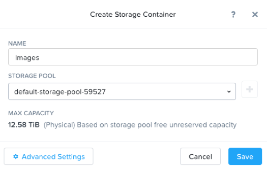
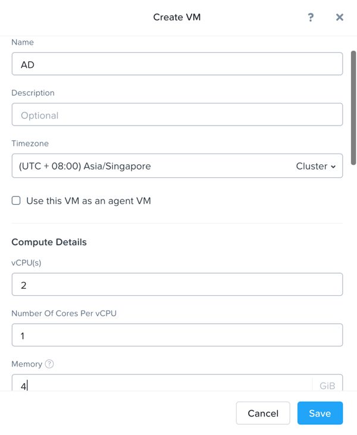
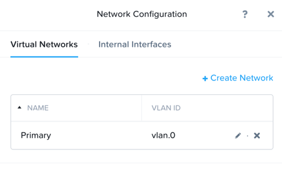
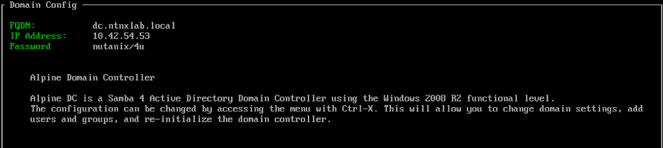

.. _AD_deploy:

---------------------------------
AD Deployment
---------------------------------

Overview
++++++++

.. note::

  Estimated time to complete: **15min**

  
Create AD VM for AD/LDAP connectivity
+++++++++++++++++++++++++++++++++++++++++

Open https://<POCxx-ABC Cluster IP>:9440 (https://10.42.xx.37:9440) in your browser and log in with the following credentials:

Username - admin
Password - techX2020!

In **Prism > Storage** , create a Storage Container called **Images**.

Using an SSH client, connect to the Node A CVM IP <10.42.xx.29> in your assigned block using the following credentials:

Username - nutanix

Password - default

Execute the following commands to upload AD image:

.. code-block:: bash

  acli image.create AutoAD container=Images image_type=kDiskImage source_url=http://10.42.194.11/workshop_staging/AutoAD.qcow2

Now we are going to create an AD VM from image AutoDC. AD is a pre-requirement of File Service. This AD service is different from the AD service created from a Windows Server. We use it just to simplify the lab and you can take a brief view of file service deployment. 

In **Prism > VM**, click **+ Create VM**

   
click **+ Add New Disk** , choose **Clone from Image Service** and image ‘AutoDC’，click **Add**.

.. image:: images/image005.png

Click **+Add new NIC** and choose **Primary**, click **Add**.

 
After AD VM is created successfully, power on AD VM, then launch console to see **domain name, IP Address and credentials of AD**. Record down them, your AD's IP is unique and has a pattern of 10.42.xx.yz. These information will be used later.

